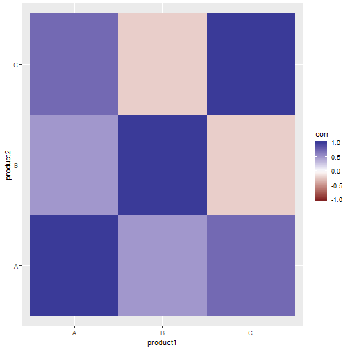

This small example aims to provide some use cases for the `tidyr` package. Let's generate some example data first:


library(lubridate)
library(tibble)
library(dplyr)
library(tidyr)
library(ggplot2)
library(forcats)
library(purrr)

set.seed(1234)

sales <- tibble(date = ymd(rep(c(20180101, 20180102, 20180103), 3)),
                product = rep(c("A", "B", "C"), each = 3),
                sales = sample(1:20, size = 9, replace = T))
sales



## # A tibble: 9 x 3
##   date       product sales
##   <date>     <chr>   <int>
## 1 2018-01-01 A           3
## 2 2018-01-02 A          13
## 3 2018-01-03 A          13
## 4 2018-01-01 B          13
## 5 2018-01-02 B          18
## 6 2018-01-03 B          13
## 7 2018-01-01 C           1
## 8 2018-01-02 C           5
## 9 2018-01-03 C          14


We want to compute the correlation of the sales from products A, B and C. The base R function `cor()` takes a matrix or data.frame and computes the correlation between all the column pairs. Thus, first we need to convert the data.frame `sales`, which is in long form, to wide form with one column per product.


cor_matrix <-
  sales %>%
    spread(key = product, value = sales) %>%
    select(-date) %>%
    cor()

cor_matrix



##           A          B          C
## A 1.0000000  0.5000000  0.7370435
## B 0.5000000  1.0000000 -0.2167775
## C 0.7370435 -0.2167775  1.0000000


To manipulate the correlation matrix using `tidyverse`-related functions we need to convert back the previous matrix to a long data.frame:


cor_tidy <-
  cor_matrix %>%
    as.data.frame() %>%
    rownames_to_column(var = "product1") %>%
    gather(key = product2, value = corr, -product1)
cor_tidy



##   product1 product2       corr
## 1        A        A  1.0000000
## 2        B        A  0.5000000
## 3        C        A  0.7370435
## 4        A        B  0.5000000
## 5        B        B  1.0000000
## 6        C        B -0.2167775
## 7        A        C  0.7370435
## 8        B        C -0.2167775
## 9        C        C  1.0000000


Now we can plot the correlation matrix using ggplo2, for instance with a heatmap:


ggplot(cor_tidy, aes(x = product1, y = product2, fill = corr)) + 
  geom_tile() + 
  scale_fill_gradient2(limits = c(-1, 1))


Another common way of representing correlation is a vertical barplot. For this type of plot we often want to ignore the diagonal and upper/lower triangle, and sort from lowest to highest:

Here we are using a neat trick to ignore rows with duplicate product IDs ignoring its order (see [this](https://stackoverflow.com/questions/38687545/r-select-first-dataframe-row-for-each-unique-pair-ignoring-order) and [this](https://stackoverflow.com/questions/28574006/unique-rows-considering-two-columns-in-r-without-order answers from Stackoverflow)). The previous trick can be generalized to more than two columns, although it is not trivial (see [this](https://stackoverflow.com/questions/30332490/finding-unique-tuples-in-r-but-ignoring-order) question for a base R solution). Let's create first some example data:


values <- c("A", "B", "C")
df <- expand.grid(ID1 = values, ID2 = values, ID3 = values, stringsAsFactors = FALSE)
df



##    ID1 ID2 ID3
## 1    A   A   A
## 2    B   A   A
## 3    C   A   A
## 4    A   B   A
## 5    B   B   A
## 6    C   B   A
## 7    A   C   A
## 8    B   C   A
## 9    C   C   A
## 10   A   A   B
## 11   B   A   B
## 12   C   A   B
## 13   A   B   B
## 14   B   B   B
## 15   C   B   B
## 16   A   C   B
## 17   B   C   B
## 18   C   C   B
## 19   A   A   C
## 20   B   A   C
## 21   C   A   C
## 22   A   B   C
## 23   B   B   C
## 24   C   B   C
## 25   A   C   C
## 26   B   C   C
## 27   C   C   C


We would like to obtain unique ID combinations without taking order into account, that is, "AAB" and "ABA" are both the same:  


distinct(df, ID = pmap_chr(select(df, starts_with("ID")),
                           ~paste0(sort(c(...)), collapse="_")))



##       ID
## 1  A_A_A
## 2  A_A_B
## 3  A_A_C
## 4  A_B_B
## 5  A_B_C
## 6  A_C_C
## 7  B_B_B
## 8  B_B_C
## 9  B_C_C
## 10 C_C_C


Note the `c(...)`, since the `.f` argument in `pmap()` is a function with as many arguments as columns in the data frame (in contrast to base `apply()`). Thus we need to collect them all in a vector, which is then sorted and finally converted into a single value with `paste(..., collapse="_")`.
