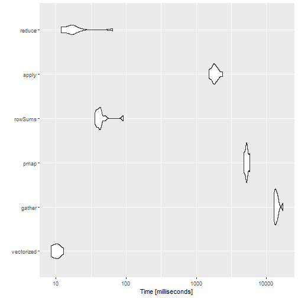

Inspired partly by [this](https://stackoverflow.com/questions/47759347/create-a-new-column-which-is-the-sum-of-specific-columns-selected-by-their-name/) and [this](https://stackoverflow.com/questions/28873057/sum-across-multiple-columns-with-dplyr/) Stackoverflow questions, I wanted to test what is the fastest way to create a new column using `dplyr` as a combination of others.

First, let's create some example data


library(tidyr)
library(dplyr)
library(tibble)
library(stringr)
library(purrr)
library(readr)
library(microbenchmark)

set.seed(1234)
n <- 1000000
d <- 6

m <- matrix(sample(c(0, 1), size = n*d, replace = TRUE), n, d,
            dimnames = list(str_pad(1:n, str_length(n), pad = "0"), 
                            c("A", "B", "C", "D", "E", "F")))

df <- as_tibble(m, rownames = 'index')


We have a data frame with 6 binary columns, and we want to create another one which is the sum of these columns. The most straighforward way is using `mutate()` directly


mutate(df, total = A + B + C + D + E + F)



## # A tibble: 1,000,000 x 8
##    index     A     B     C     D     E     F total
##    <chr> <dbl> <dbl> <dbl> <dbl> <dbl> <dbl> <dbl>
##  1 00001     0     0     0     1     1     0     2
##  2 00002     1     0     0     0     0     1     2
##  3 00003     1     1     0     1     0     1     4
##  4 00004     1     0     0     1     0     0     2
##  5 00005     1     0     0     1     1     0     3
##  6 00006     1     1     1     0     0     1     4
##  7 00007     0     1     0     0     1     1     3
##  8 00008     0     0     0     0     1     0     1
##  9 00009     1     0     1     1     1     1     5
## 10 00010     1     1     0     0     0     0     2
## # ... with 999,990 more rows


This is probably going to be very fast, since it takes full advantage of R vectorized operations. The downside is that if we want to sum up say, 20 columns, we have to write down the name of all of them.

The second approach is to use tidy data principles to transform the previous data frame into long form and then perform the operation by group:


df %>%
  gather(key, value, -index) %>%
  group_by(index) %>%
  summarize(total = sum(value))



## # A tibble: 1,000,000 x 2
##    index total
##    <chr> <dbl>
##  1 00001     2
##  2 00002     2
##  3 00003     4
##  4 00004     2
##  5 00005     3
##  6 00006     4
##  7 00007     3
##  8 00008     1
##  9 00009     5
## 10 00010     2
## # ... with 999,990 more rows


The downside of this approach is that we have as many groups as rows in the original data frame, and usually grouped operations are not very efficient when the number of groups is very large. Of course, depending on the meaning of the columns "A", "B", etc. the data frame `df` may not be a tidy dataset, and it is always a good idea to transform those using tidy data principles. However, it also may already be in tidy form.

The next possibility is to iterate over the rows of the original data, summing them up. Here we can use the functions `apply()` or `rowSums()` from base R and `pmap()` from the `purrr` package.


mutate(df, total = rowSums(select(df, -index)))



## # A tibble: 1,000,000 x 8
##    index     A     B     C     D     E     F total
##    <chr> <dbl> <dbl> <dbl> <dbl> <dbl> <dbl> <dbl>
##  1 00001     0     0     0     1     1     0     2
##  2 00002     1     0     0     0     0     1     2
##  3 00003     1     1     0     1     0     1     4
##  4 00004     1     0     0     1     0     0     2
##  5 00005     1     0     0     1     1     0     3
##  6 00006     1     1     1     0     0     1     4
##  7 00007     0     1     0     0     1     1     3
##  8 00008     0     0     0     0     1     0     1
##  9 00009     1     0     1     1     1     1     5
## 10 00010     1     1     0     0     0     0     2
## # ... with 999,990 more rows


These function perform the same operation but differ in many aspects:

   * `apply()` coerces the data frame into a matrix, so care needs to be taken with non-numeric columns.
   * `rowSums()` can only be used if we want to perform the sum or the mean (`rowMeans()`), but not for other operations.
   * `pmap()` has variants that let you specifiy the type of the output (`pmap_dbl()`, `pmap_lgl()`) and thus are safer. If the output cannot be coerced to the given type an exception will be thrown.

Finally, we have the `reduce()` function from the `purrr` package (see [this](https://adv-r.hadley.nz/functionals.html#reduce) chapter from "Advanced R" by Hadley Wickham to learn more). This function lets us take full advantage of R vectorized operation and write the operation very concisely, whether it be 6 or 20 columns.


mutate(df, total = reduce(select(df, -index), `+`))



## # A tibble: 1,000,000 x 8
##    index     A     B     C     D     E     F total
##    <chr> <dbl> <dbl> <dbl> <dbl> <dbl> <dbl> <dbl>
##  1 00001     0     0     0     1     1     0     2
##  2 00002     1     0     0     0     0     1     2
##  3 00003     1     1     0     1     0     1     4
##  4 00004     1     0     0     1     0     0     2
##  5 00005     1     0     0     1     1     0     3
##  6 00006     1     1     1     0     0     1     4
##  7 00007     0     1     0     0     1     1     3
##  8 00008     0     0     0     0     1     0     1
##  9 00009     1     0     1     1     1     1     5
## 10 00010     1     1     0     0     0     0     2
## # ... with 999,990 more rows


We can measure the running time of every snippet of code using the package `microbenchmark`.


check_equal <- function(values) {
  all(sapply(values[-1], function(x) all_equal(values[[1]], x)))
}

bm <- microbenchmark(
  "vectorized" = {
    df %>%
      mutate(total = A + B + C + D + E + F) %>%
      select(index, total)
  },
  "gather" = { 
    df %>%
      gather(key, value, -index) %>%
      group_by(index) %>%
      summarize(total = sum(value))
  },
  "pmap" = {
    df %>%
      mutate(total = pmap_dbl(select(., -index), sum)) %>%
      select(index, total)      
  },
  "rowSums" = {
    df %>%
      mutate(total = rowSums(select(., -index))) %>%
      select(index, total)      
  },
  "apply" = {
    df %>%
      mutate(total = apply(select(., -index), 1, sum)) %>%
      select(index, total)      
  },
  "reduce" = {
    df %>%
      mutate(total = reduce(select(df, -index), `+`)) %>%
      select(index, total)
  },
  check = check_equal,
  times = 10
)



print(bm, order = 'median', signif = 3)



## Unit: milliseconds
##        expr      min       lq    mean  median      uq     max neval  cld
##  vectorized     8.52     8.77    10.2    10.2    11.2    12.9    10 a   
##      reduce    11.80    12.30    20.7    16.5    18.2    64.3    10 a   
##     rowSums    35.70    38.30    46.1    42.3    42.8    90.9    10 a   
##       apply  1520.00  1740.00  1850.0  1800.0  2020.0  2360.0    10  b  
##        pmap  4770.00  5010.00  5230.0  5200.0  5410.0  5810.0    10   c 
##      gather 12800.00 13100.00 14000.0 13600.0 14300.0 17200.0    10    d


The results are mostly as expected. The vectorized code is the fastest, but it is not very concise. The `reduce()` function is also very fast, and can be used with any number of columns. The slowest is the `gather()`approach, and it should probably be avoided unless you already need to tidy your data.

Two things were really surprising:
  * `rowSums()` is much faster than `apply()` and almost as good as `reduce()`. As mentioned before it can only be used when computing the sum or the mean.
  * `apply()` is twice as fast as `pmap_dbl()`, probably because of the extra checks needed by `pmap()`. However, I would expect them to be much closer.
  
We end this post with a violin plot of the results:


library(ggplot2)
autoplot(bm)


