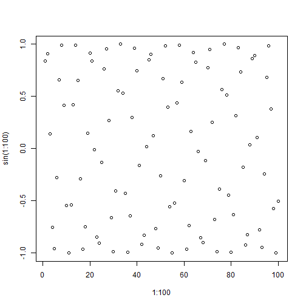

Sin plot


plot(1:100, sin(1:100))



library(lubridate)
library(tibble)
library(dplyr)
library(tidyr)
library(ggplot2)
library(forcats)
library(purrr)

set.seed(1234)

sales <- tibble(date = ymd(rep(c(20180101, 20180102, 20180103), 3)),
                product = rep(c("A", "B", "C"), each = 3),
                sales = sample(1:20, size = 9, replace = T))
sales



## # A tibble: 9 x 3
##   date       product sales
##   <date>     <chr>   <int>
## 1 2018-01-01 A           3
## 2 2018-01-02 A          13
## 3 2018-01-03 A          13
## 4 2018-01-01 B          13
## 5 2018-01-02 B          18
## 6 2018-01-03 B          13
## 7 2018-01-01 C           1
## 8 2018-01-02 C           5
## 9 2018-01-03 C          14



library(corrr)



library(dplyr)
library(tidyr)

sales %>%
  spread(key = product, value = sales) %>%
  select(-date) %>%
  correlate() %>%
  shave() %>%
  stretch(na.rm = TRUE)



## # A tibble: 3 x 3
##   x     y          r
##   <chr> <chr>  <dbl>
## 1 A     B      0.5  
## 2 A     C      0.737
## 3 B     C     -0.217


